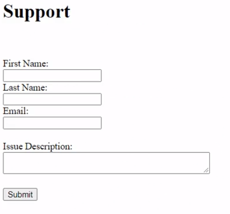

# Learning ASP.NET

O ASP.NET é um popular framework web desenvolvido pela Microsoft. Este caminho de aprendizado oferece as habilidades necessárias para trabalhar com tecnologias tanto do lado do cliente quanto do servidor como um desenvolvedor ASP.NET. Para seguir este caminho, é necessário ter conhecimento básico de HTML, CSS e JavaScript, bem como fluência básica em C#.

- Instrutor: Janan Siam
- Passos iniciais

## Chp 2: Web Forms
Implemente na solução um sistema de cadratros de bug/issues, onde o usúario ira fornecer:
- nome
- sobrenome
- e-mail
- descrição do problema

Nota-se que os campos não devem estar em brancos

